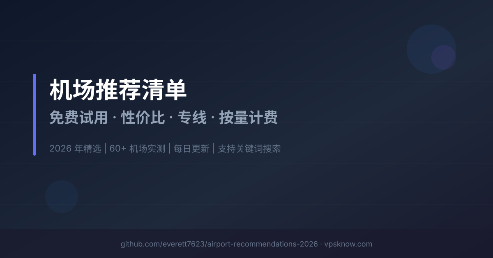

# 机场推荐清单（2026）｜免费试用 / 性价比 / 专线 / 按量计费

> **📌 本项目定位：** 机场推荐索引与筛选工具 | 覆盖免费试用、入门经济、性价比、高端专线、按量计费等全类型 | 支持关键词搜索与标签筛选 | 每日自动同步 VPSKnow 数据
> 如果这个项目对你有帮助，请点个 Star ⭐ 支持一下！
>
> 💡 **更全的图文评测、实时测速数据与优惠活动请访问：** [VPSKnow.com/airport-recommendations](https://www.vpsknow.com/airport-recommendations)

**关键词：** 机场推荐、VPN推荐、科学上网、翻墙工具、梯子推荐、SS机场、V2Ray机场、Trojan机场、IPLC专线、IEPL专线、流媒体解锁、Netflix机场、ChatGPT节点、稳定机场、高速机场、2026机场推荐

---

## 📋 目录导航

- [🎁 免费试用专区](#category-free-trial)
- [💸 入门经济型](#category-budget)
- [⚖️ 性价比均衡机场](#category-balanced)
- [👑 高端专线机场](#category-premium)
- [💰 按量计费机场](#category-pay-as-you-go)
- [🔗 无AFF / 纯净推荐](#category-no-aff)
- [📊 完整服务商索引](#-完整服务商索引)
- [📚 使用教程](#-使用教程)
- [❓ 常见问题](#-常见问题)
- [📄 许可与利益披露](#license-and-disclosure)
- [⚠️ 免责声明](#disclaimer)

---

> ⚠️ **风险提示：** 机场行业存在停服/跑路风险，建议**优先月付**，避免大额年付。同时备用 2–3 个机场互为容灾。详见 [免责声明](#disclaimer) 与 [风险控制指南](docs/blacklist.md)。

---

## 🏆 本期主推机场

以下名单按固定编辑顺序展示，机场详情、价格和状态随 VPSKnow 数据同步更新。

| 机场 | 类型 | 起步价 | 直达 |
|---|---|---|---|
| 网际快车 | Vless/Hysteria2 | 免费试用，¥6.8/20GB起 | [官网直达](https://go.uukk.de/wjkc) |
| 喵喵网络 | Hysteria2直连 | ¥20/100GB起（一次性） | [官网直达](https://go.uukk.de/vpnmiao) |
| COCODUCK VPN | IEPL/BGP | ¥17/月 100GB起 | [官网直达](https://go.uukk.de/cocoduck) |
| Fastlink | BGP/IPLC页面口径 | ¥20/月起 | [官网直达](https://go.uukk.de/fastlink) |
| TAG | 线路架构待验证 | ¥114/月 500GB | [官网直达](https://go.uukk.de/tag) |
| MESL | IEPL专线 | ¥50/月起 | [官网直达](https://go.uukk.de/mesl) |
| ImmTelecom | IEPL/IPLC专线 | ¥72.45/月起 | [官网直达](https://go.uukk.de/immtele) |
| 肯の机 | CN2 GIA/9929/CMIN2 | ¥40/月 100GB起 | [官网直达](https://go.uukk.de/kendeji) |
| ViKing Links | 专线+优化直连 | ¥72/月 500GB | [官网直达](https://go.uukk.de/vikinglinks) |
| WgetCloud | BGP专线 | ¥79/月起 | [官网直达](https://go.uukk.de/wgetcloud) |

---

## 📢 最新活动与公告

### 2026-10-08 更新
- ✅ **同步：** 与 [VPSKnow.com](https://www.vpsknow.com/airport-recommendations) 机场推荐数据同步更新。
- 🔄 **调整：** 可信云 的资料、分类或运营状态已更新。
- ⛔ **当前正式下架记录：** Sogo云、OneStep。

👉 **查看完整评测与详细图文教程：[VPSKnow 机场推荐榜单](https://www.vpsknow.com/airport-recommendations)**（实时更新，内容更全）

---

## ⚡ 快速选择指南

**根据你的需求，3秒找到最适合的机场：**

| 使用场景 | 推荐类型 | 参考价格 | 代表机场 | 直达链接 |
|---------|---------|---------|---------|---------|
| 🆓 先测试后购买 | 免费试用 | 免费 | 网际快车、喵喵网络 | [查看详情](#category-free-trial) |
| 💰 预算有限（学生党） | 入门经济 | ¥12/月 100GB起（年付¥77起） | 山水云、锦云、鲤云 | [查看详情](#category-budget) |
| ⚡ 日常使用（看剧、办公） | 性价比均衡 | ¥20/月起 | Fastlink、极速Cloud、Nice加速专线机场 | [查看详情](#category-balanced) |
| 👔 商务办公（高稳定） | 高端专线 | ¥114/月 500GB | TAG、MESL | [查看详情](#category-premium) |
| 🎮 游戏加速（低延迟） | 高端专线 | ¥72.45/月起 | ImmTelecom | [查看详情](#category-premium) |
| 📦 轻度使用（备用） | 按量计费 | ¥20/100GB起（一次性） | 喵喵网络、魔戒 | [查看详情](#category-pay-as-you-go) |
| 🔗 纯净推荐（无返利） | 无AFF/纯净 | ¥273/年起 | AmyTelecom、Kuromis | [查看详情](#category-no-aff) |

---

## 🎁 免费试用专区

**拒绝盲选：提供试用套餐或者流量，先测试节点质量与兼容性，满意再订阅**

### 1. 网际快车

**🔗 官网：** [点击访问](https://go.uukk.de/wjkc)

| 项目 | 说明 |
|-----|------|
| **线路类型** | Vless/Hysteria2 |
| **接入方式** | 通用订阅 + 专用客户端 |
| **优惠券/码** | `试用券: vpsknow（3小时/5GB）` |
| **核心特色** | 首轮测评已补，流量不过期，家宽节点，AI出口观察 |
| **简介** | 网际快车已补首轮测评，可选择快车专用客户端或第三方通用订阅，截图显示永久流量包、日享套餐、Vless / Hysteria2 节点和 SoftBank 日本家宽原生 IP。更适合先按量备用和观察家宽节点，流媒体与晚高峰仍待补测。 |
| **起步价** | 免费试用，¥6.8/20GB起 |
| **推荐指数** | ⭐⭐⭐⭐ · 备用候选 · 证据中 |

**核心标签：** `白嫖` `试用` `按量备用`

---

### 2. 喵喵网络

**🔗 官网：** [点击访问](https://go.uukk.de/vpnmiao)

| 项目 | 说明 |
|-----|------|
| **线路类型** | 优质直连 |
| **接入方式** | 通用订阅 + 专用客户端 |
| **优惠券/码** | `优惠券: vpsknow` |
| **核心特色** | 免费试用+¥8/月起，Emby影音权益，Hysteria2/美国0.1x，IP风险需注意 |
| **简介** | 喵喵网络已补首轮测评，免费试用和 ¥8/月起入口降低试错成本，并提供 Emby 影音权益；具体开通方式、片库和套餐范围需在下单前核对。Hysteria2 节点、美国 0.1x 节点、AI/部分流媒体解锁和 YouTube 4K 首轮可用，但 HostPapa 机房 IP 风险较高，建议先短周期试用。 |
| **起步价** | 免费试用，¥8/月起 |
| **推荐指数** | ⭐⭐⭐ · 备用候选 · 证据中 |

**核心标签：** `4K秒开` `Emby影音` `免费试用`

---

> 🔗 **更多免费试用专区机场评测 →** [VPSKnow 机场推荐榜单](https://www.vpsknow.com/airport-recommendations)

---

## 💸 入门经济型

**价格友好，适合预算有限的新手与学生党，满足日常上网等需求**

### 1. 山水云

**🔗 官网：** [点击访问](https://go.uukk.de/shanshuiyun)

| 项目 | 说明 |
|-----|------|
| **线路类型** | VLESS/通用订阅 |
| **接入方式** | 通用订阅 |
| **优惠券/码** | `优惠券: 2026888（8折）` |
| **核心特色** | 首轮测评已补，通用订阅约20+节点，美国节点4K/AI首轮可用，部分节点需复查 |
| **简介** | 山水云已补首轮测评：通用订阅在 Clash Verge 可见约20+节点，覆盖港澳台、日韩、新加坡、欧美及东南亚。美国样本的 YouTube 4K、Claude、Cloudflare 与 IP 检测首轮可用，但日本、香港及部分欧美节点出现 Timeout；适合先月付验证，不把单次结果当作全节点或长期稳定承诺。 |
| **起步价** | ¥12/月 100GB起（年付¥77起） |
| **推荐指数** | ⭐⭐⭐ · 短期候选 · 证据中 |

**核心标签：** `低价入门` `通用订阅` `短周期先试`

---

### 2. 锦云

**🔗 官网：** [点击访问](https://go.uukk.de/jinyun)

| 项目 | 说明 |
|-----|------|
| **线路类型** | Vless节点 |
| **接入方式** | 通用订阅 |
| **优惠券/码** | `优惠券: 2026888（8折）` |
| **核心特色** | 首轮测评已补，Vless节点，¥4.8/月起，AI/4K首轮可用 |
| **简介** | 锦云当前面板提供可复制的通用订阅，未确认品牌专用客户端；套餐含 ¥4.8/月 50GB、¥7.2/月 100GB、¥99/年 128GB/月和不限时流量包。Clash 显示 AnyTLS 节点与故障转移，主流 AI/流媒体及 YouTube 4K 首轮可用；美国出口为机房 IP，长期晚高峰仍待复查。 |
| **起步价** | ¥4.8/月 50GB起 |
| **推荐指数** | ⭐⭐ · 争议待核 · 证据低 |

**核心标签：** `AI解锁` `低价入门` `短周期先试`

---

### 3. 鲤云

**🔗 官网：** [点击访问](https://go.uukk.de/liyun)

| 项目 | 说明 |
|-----|------|
| **线路类型** | VLESS节点 |
| **接入方式** | 通用订阅 |
| **优惠券/码** | `优惠券: liyun888（8折）` |
| **核心特色** | 首轮实测已补，¥7/月50GB起，24个VLESS节点，AI/4K首轮可用 |
| **简介** | 鲤云当前面板提供可复制的通用订阅，未确认品牌专用客户端；套餐从 ¥7/月 50GB 起，另有 ¥90/年每月 128GB 与 ¥140/100GB 不限时流量包。Clash Verge 截图显示 24 个 VLESS / UDP / XUDP 地区节点，美国节点单次 Ookla 下载 130.72Mbps，AI、Netflix 与 YouTube 4K 首轮可用；但出口为 AS38136 机房 IP，WebRTC 与本地时区、语言环境需注意。 |
| **起步价** | ¥7/月 50GB起 |
| **推荐指数** | ⭐⭐⭐⭐ · 短期候选 · 证据中 |

**核心标签：** `AI解锁` `低价入门` `短周期先试`

---

### 4. 速界

**🔗 官网：** [点击访问](https://go.uukk.de/speedworld)

| 项目 | 说明 |
|-----|------|
| **线路类型** | 全 IPLC 专线 |
| **接入方式** | 专用客户端 |
| **优惠券/码** | `优惠码: sujie888（8折）` |
| **核心特色** | ¥15/月·50GB体验包，¥90/年·50GB/月，本地联通下载8.56Mbps，电信5G下载129Mbps |
| **简介** | 速界仅支持专用客户端，当前有 ¥15/月 50GB 体验包和 ¥90/年 50GB/月限时包，页面标注全 IPLC、全节点 x1、不限设备。2026-08-28 复测中，本地联通美国节点下载 8.56Mbps，手机电信 5G 下载 129Mbps，线路差异明显，建议先月付。 |
| **起步价** | ¥90/年起（折前） |
| **推荐指数** | ⭐⭐ · 线路差异 · 证据中 |

**核心标签：** `线路差异明显` `不限设备` `全节点x1`

---

### 5. 轻语机场

**🔗 官网：** [点击访问](https://go.uukk.de/qingyu)

| 项目 | 说明 |
|-----|------|
| **线路类型** | AnyTLS/IEPL |
| **接入方式** | 通用订阅 |
| **核心特色** | Emby影音权益，¥10/月起，AnyTLS/IEPL，4K/AI首轮可用 |
| **简介** | 轻语机场已补首轮测评，¥10/月起，并提供 Emby 影音权益；具体开通方式、片库和套餐范围需在下单前核对。截图显示 28 个节点，主打 AnyTLS / Shadowsocks、专线 IEPL 和中转线路。YouTube 4K、ChatGPT、Claude、Gemini、Netflix 等首轮可用，但 BAGE CLOUD 机房 IP 风险中等，建议先月付验证晚高峰。 |
| **起步价** | ¥10/月起 |
| **推荐指数** | ⭐⭐⭐⭐ · 短期候选 · 证据中 |

**核心标签：** `AI解锁` `Emby影音` `低价入门`

---

### 6. COCODUCK VPN

**🔗 官网：** [点击访问](https://go.uukk.de/cocoduck)

| 项目 | 说明 |
|-----|------|
| **线路类型** | IEPL/BGP |
| **接入方式** | 通用订阅 + 专用客户端 |
| **核心特色** | 51项VLESS节点，4K/AI首轮可用，¥77/年40GB/月，不限设备/支持试用 |
| **简介** | COCODUCK VPN 已完成首轮实测并确认同时支持通用订阅与专用客户端：套餐含 ¥17/月 100GB 至 ¥115/月 1000GB，以及 ¥77/年、每月 40GB 的迷你鸭77。截图记录 51 项 VLESS 节点、约 139.94Mbps 下载与 YouTube 4K 播放；AI 可用，但测试出口为机房 IP，DNS/WebRTC 环境仍需注意。 |
| **起步价** | ¥17/月 100GB起 |
| **推荐指数** | ⭐⭐⭐⭐ · 短期候选 · 证据中 |

**核心标签：** `VLESS` `性价比` `短周期先试`

---

### 7. EdgeNova

**🔗 官网：** [点击访问](https://go.uukk.de/edgenova)

| 项目 | 说明 |
|-----|------|
| **线路类型** | IEPL专线 |
| **接入方式** | 专用客户端 |
| **优惠券/码** | `优惠码: XK808` |
| **核心特色** | IEPL专线低延迟，60+全球优质节点，AI工具全兼容，不限设备/不限速 |
| **简介** | EdgeNova，2026年新晋高性能机场。全节点采用 IEPL 专线直连，绕过公网拥堵，确保在高峰时段依然拥有极低的延迟与超高的稳定性。完美流媒体与 AI 工具解锁，全套餐不限速、不限设备数、无流量倍率。 |
| **起步价** | ¥86/年起（优惠后） |
| **推荐指数** | 待评 · 证据低 |

**核心标签：** `专线` `新锐` `全兼容`

---

### 8. 秒秒云

**🔗 官网：** [点击访问](https://go.uukk.de/miaomiaoyun)

| 项目 | 说明 |
|-----|------|
| **线路类型** | 隧道中转 |
| **优惠券/码** | `优惠券: j4u5eVFw（8折）` |
| **核心特色** | 海外中转节点，AnyTLS协议，年付低至¥79起，支持不限时套餐 |
| **简介** | 秒秒云采用海外中转节点和 AnyTLS 协议，提供低至 ¥79/年的轻量套餐以及不限时一次性流量包；线路、解锁和晚高峰表现仍建议先用短周期套餐自行验证。 |
| **起步价** | ¥14/月起（年付¥79起） |
| **推荐指数** | 待评 · 证据低 |

**核心标签：** `高性价比` `AnyTLS` `不限时可选`

---

### 9. 熊猫cloud

**🔗 官网：** [点击访问](https://go.uukk.de/cly)

| 项目 | 说明 |
|-----|------|
| **线路类型** | VLESS节点 |
| **接入方式** | 通用订阅 |
| **优惠券/码** | `优惠券: 88888（8折）` |
| **核心特色** | 首轮实测已补，通用订阅，¥8试用/¥7月付，12个VLESS节点 |
| **简介** | 熊猫cloud（原财路云，2026-09-15 更名，注册链接与短链不变）已补首轮测评并确认支持通用订阅。2026-08-16 套餐包含 ¥8/20GB 限购试用、¥7/月 50GB、¥14/月 100GB、¥28/月 200GB、¥21/季 64GB/月、¥168/年 128GB/月及 ¥150/100GB 不限时包。2026-07-30 美国节点单次 Ookla 下载 112.25Mbps，Cloudflare 下载 105.64Mbps，YouTube 4K 连接约 111.9Mbps；AI 与主流流媒体多数可用，但出口为机房 IP，DNS/WebRTC 和较高延迟需留意。 |
| **起步价** | ¥8试用；¥7/月50GB |
| **推荐指数** | ⭐⭐⭐⭐ · 短期候选 · 证据中 |

**核心标签：** `VLESS` `低价入门` `短周期先试`

---

### 10. 瞬云

**🔗 官网：** [点击访问](https://go.uukk.de/sy)

| 项目 | 说明 |
|-----|------|
| **线路类型** | ANYCAST专线 |
| **接入方式** | 通用订阅 + 专用客户端 |
| **优惠券/码** | `优惠码: 20OFF（8折）` |
| **核心特色** | ANYCAST专线，原生IP全解锁，多设备共享，7×24真人客服 |
| **简介** | 瞬云采用直连加专线架构与 ANYCAST 网络，主打三网入口优化、流媒体与 AI 服务支持；入门套餐低至 ¥16/月，另有 ¥99/年限量小包，晚高峰表现仍建议短周期实测。 |
| **起步价** | ¥16/月起（优惠后） |
| **推荐指数** | 待评 · 证据低 |

**核心标签：** `原生节点` `流媒体解锁` `高性价比`

---

### 11. 唯兔云

**🔗 官网：** [点击访问](https://go.uukk.de/wty)

| 项目 | 说明 |
|-----|------|
| **线路类型** | IPLC专线 |
| **接入方式** | 专用客户端 |
| **优惠券/码** | `优惠码: rabbit` |
| **核心特色** | IPLC专线，不限设备数，流媒体/TikTok解锁，年付¥79.9起 |
| **简介** | 唯兔云，主打高性价比 IPLC 专线。采用新 SS 协议，不限设备数且无倍率，稳定解锁流媒体与AI服务。年付 79.9 元（约 ¥6.6/月），另有不限时套餐可选。 |
| **起步价** | ¥6.6/月起（年付） |
| **推荐指数** | 待评 · 证据低 |

**核心标签：** `高性价比` `流媒体` `不限时可选`

---

> 🔗 **更多入门经济型机场评测 →** [VPSKnow 机场推荐榜单](https://www.vpsknow.com/airport-recommendations)

---

## ⚖️ 性价比均衡机场

**价格适中，性能稳定，适合日常使用、流媒体观影和大多数用户**

### 1. Fastlink

**🔗 官网：** [点击访问](https://go.uukk.de/fastlink)

| 项目 | 说明 |
|-----|------|
| **线路类型** | BGP/IPLC页面口径 |
| **接入方式** | 专用客户端 |
| **核心特色** | 首轮测评已补，约30项可见节点，专用客户端，少量节点需复查 |
| **简介** | Fastlink 已补首轮测评：专用客户端可见约30项节点，主要覆盖港澳台、东南亚、欧美等常用地区；YouTube 4K、Claude 与 Cloudflare 样本首轮可用，但少量节点 Timeout，节点覆盖与长期稳定性不宜夸大，建议先月付。 |
| **起步价** | ¥20/月起 |
| **推荐指数** | ⭐⭐⭐ · 恢复观察 · 证据中 |

**核心标签：** `专用客户端` `约30项节点` `短周期先试`

---

### 2. 极速Cloud

**🔗 官网：** [点击访问](https://go.uukk.de/jscloud)

| 项目 | 说明 |
|-----|------|
| **线路类型** | CN2 GIA/AS9929/CMIN2 |
| **接入方式** | 通用订阅 |
| **优惠券/码** | `优惠码: ikds88（9折）` |
| **核心特色** | 首轮测评已补，49项VLESS节点/功能，YouTube 4K约91.8Mbps |
| **简介** | 极速Cloud 已补首轮测评：Clash 代理组显示 49 项 VLESS / UDP / XUDP 节点，三网高带宽批量测速多数常用地区速度较高，YouTube 4K 与常见 AI / 流媒体首轮可用；部分节点存在 Error 或 0bps，DNS/WebRTC 也需排查，建议先月付。 |
| **起步价** | ¥15/月起 |
| **推荐指数** | ⭐⭐⭐ · 短期候选 · 证据中 |

**核心标签：** `VLESS` `多地区` `隐私待查`

---

### 3. Nice加速专线机场

**🔗 官网：** [点击访问](https://go.uukk.de/nicecc)

| 项目 | 说明 |
|-----|------|
| **线路类型** | 南北双通道专线 |
| **接入方式** | 通用订阅 + 专用客户端 |
| **核心特色** | 南北双通道专线，AI首轮可用，月付¥12起，建议先月付 |
| **简介** | Nice加速专线机场主推月付套餐，当前 ¥12/月 30GB 起，并提供 100GB 至 800GB 月流量及一次性流量包。当前官网同时提供通用订阅快速导入与 Nice 专用客户端；首轮实测中台湾家宽、AI 与 YouTube 4K 可用，晚高峰长期稳定性仍需继续复查。 |
| **起步价** | ¥12/月 30GB起 |
| **推荐指数** | ⭐⭐ · 争议待核 · 证据低 |

**核心标签：** `AI解锁` `美国台湾家宽` `短周期先试`

---

### 4. 极连云

**🔗 官网：** [点击访问](https://go.uukk.de/jly)

| 项目 | 说明 |
|-----|------|
| **线路类型** | IPLC/IEPL专线 |
| **接入方式** | 专用客户端 |
| **优惠券/码** | `优惠码: JLY888（8折）` |
| **核心特色** | IPLC/IEPL专线，原生IP全解锁，三网优化，年付¥96起 |
| **简介** | 极连云, 专注出海加速的 IPLC/IEPL 专线机场，三网入口优化保障稳定性。拥有 60+ 独立 IP 节点，全线原生 IP 完美解锁 ChatGPT、Netflix 等流媒体。年付轻量版仅需 96 元，性价比极高。 |
| **起步价** | ¥14.4/月起 |
| **推荐指数** | ⭐⭐ · 争议待核 · 证据低 |

**核心标签：** `专线` `流媒体` `高性价比`

---

### 5. 光速云

**🔗 官网：** [点击访问](https://go.uukk.de/lightspeed)

| 项目 | 说明 |
|-----|------|
| **线路类型** | IPLC专线 |
| **接入方式** | 专用客户端 |
| **核心特色** | IPLC专线，原生IP流媒体，晚高峰不限速，月付¥17起 |
| **简介** | 光速云, 主打极高性价比的隧道中转与 IPLC 专线机场。拥有 60+ 独立 IP 节点，带宽冗余充足。原生 IP 稳定解锁 Netflix、TikTok 等流媒体，是晚高峰稳定观影的优质选择。 |
| **起步价** | ¥17/月起 |
| **推荐指数** | ⭐⭐ · 争议待核 · 证据低 |

**核心标签：** `高性价比` `流媒体` `大流量`

---

### 6. 全球云

**🔗 官网：** [点击访问](https://go.uukk.de/globalyun)

| 项目 | 说明 |
|-----|------|
| **线路类型** | IPLC/IEPL专线 |
| **接入方式** | 专用客户端 |
| **优惠券/码** | `月付及以上 8 折：gz80；年付 85 折：gz85（有效期 2026-09-24 至 2026-10-25，结账页复核）` |
| **核心特色** | IPLC/IEPL专线，原生节点流媒体全解锁，晚高峰高冗余不卡顿，轻量版年付99元起 |
| **简介** | 全球云，采用企业级 IPLC/IEPL 专线，结合智能负载均衡与三网入口优化，2Gbps+ 带宽接入，晚高峰稳定。原生节点完美解锁 Netflix、Disney+、TikTok 及 ChatGPT。 |
| **起步价** | ¥20/月起（年付¥99起） |
| **推荐指数** | ⭐⭐ · 争议待核 · 证据低 |

**核心标签：** `流媒体` `专线` `高性价比`

---

### 7. 二猫云

**🔗 官网：** [点击访问](https://go.uukk.de/2maoyun)

| 项目 | 说明 |
|-----|------|
| **线路类型** | IEPL/IPLC专线 |
| **接入方式** | 专用客户端 |
| **优惠券/码** | `优惠码: ermao888（8折）` |
| **核心特色** | IEPL/IPLC专线，专用客户端，不限设备数，抗封锁容灾 |
| **简介** | 二猫云，新晋高品质机场，全线采用 IEPL/IPLC 专线，晚高峰稳定不卡。稳定解锁流媒体与AI服务，不限速、不限制设备数量，仅提供全平台专用客户端，不提供通用订阅。 |
| **起步价** | ¥89/年起 |
| **推荐指数** | ⭐⭐ · 争议待核 · 证据低 |

**核心标签：** `专用客户端` `不限设备` `新晋推荐`

---

### 8. 一翻云

**🔗 官网：** [点击访问](https://go.uukk.de/1flyun)

| 项目 | 说明 |
|-----|------|
| **线路类型** | IEPL专线 |
| **接入方式** | 专用客户端 |
| **优惠券/码** | `优惠码: 1FLYYUN（9折）` |
| **核心特色** | VLESS+IEPL专线，60+节点x1倍率，晚高峰不限速，年付¥100/年起 |
| **简介** | 一翻云，VLESS 协议 + 企业级 IEPL 专线，三网优化智能负载均衡。60+节点覆盖港台日新马美等全球地区，全节点 x1 倍率，晚高峰不限速。流媒体稳定解锁，年付版 ¥100/年，性价比突出。 |
| **起步价** | ¥25/月起（年付¥100/年） |
| **推荐指数** | ⭐⭐ · 争议待核 · 证据低 |

**核心标签：** `新晋推荐` `流媒体解锁` `专线稳定`

---

### 9. 快狸

**🔗 官网：** [点击访问](https://go.uukk.de/kuaili)

| 项目 | 说明 |
|-----|------|
| **线路类型** | IEPL专线 |
| **接入方式** | 专用客户端 |
| **优惠券/码** | `优惠码: vpsknow（8折）` |
| **核心特色** | IEPL专线接入，专用客户端，全线流媒体/AI解锁，晚高峰4K流畅 |
| **简介** | 快狸提供 VLESS 协议与企业级 IEPL 专线接入，支持三网优化分流、流媒体与 AI 服务。目前仅支持专用客户端，不提供通用订阅。 |
| **起步价** | ¥96/年起（折后） |
| **推荐指数** | 待评 · 证据低 |

**核心标签：** `专用客户端` `IEPL专线` `流媒体解锁`

---

### 10. U1S1

**🔗 官网：** [点击访问](https://go.uukk.de/u1s1)

| 项目 | 说明 |
|-----|------|
| **线路类型** | 中转专线 |
| **接入方式** | 专用客户端 |
| **优惠券/码** | `优惠码: U1S1（85折）` |
| **核心特色** | 不限设备与IP，千兆极速带宽，晚高峰不降速，流媒体/AI全解锁 |
| **简介** | U1S1机场，完美解锁 TikTok、ChatGPT，以及 Netflix、Disney+、HBO 等全球主流流媒体平台。承诺晚高峰绝不降速，不限制IP地址与连接设备的数量，58 个节点畅连全球。新人特惠85折：U1S1 |
| **起步价** | ¥18.8/月起 |
| **推荐指数** | 待评 · 证据低 |

**核心标签：** `不限设备` `千兆带宽` `流媒体全解锁`

---

### 11. 光年梯

**🔗 官网：** [点击访问](https://go.uukk.de/lightyearti)

| 项目 | 说明 |
|-----|------|
| **线路类型** | IEPL专线 |
| **接入方式** | 专用客户端 |
| **核心特色** | IEPL专线，全节点1倍率，7折优惠中，不限时套餐 |
| **简介** | 光年梯, 新加坡团队运营的 IEPL SS 专线机场。全节点 1 倍率，晚高峰不限速，稳定解锁 ChatGPT 及流媒体。 |
| **起步价** | ¥18/月起 |
| **推荐指数** | 待评 · 证据低 |

**核心标签：** `SS协议` `稳定` `新加坡背景`

---

### 12. 宇宙云

**🔗 官网：** [点击访问](https://go.uukk.de/yuzhoucloud)

| 项目 | 说明 |
|-----|------|
| **线路类型** | IEPL专线 |
| **接入方式** | 专用客户端 |
| **核心特色** | VLESS+IEPL专线，60+节点x1倍率，晚高峰不限速，专用客户端 |
| **简介** | 宇宙云，VLESS 协议 + 企业级 IEPL 专线，三网优化智能负载均衡。60+节点覆盖港台日新马美等全球地区，全节点专线接入，晚高峰不限速4K秒开。流媒体稳定解锁，提供超值年付小包 ¥120/年，仅提供专用客户端一键连接，不提供通用订阅。 |
| **起步价** | ¥12.5/月起（年付¥96/年） |
| **推荐指数** | ⭐ · 暂停推荐 · 证据中 |

**核心标签：** `新晋推荐` `流媒体解锁` `专线稳定`

---

> 🔗 **更多性价比均衡机场评测 →** [VPSKnow 机场推荐榜单](https://www.vpsknow.com/airport-recommendations)

---

## 👑 高端专线机场

**追求极致稳定、低延迟与速度，适合商务办公、游戏加速及专业用户**

### 1. TAG

**🔗 官网：** [点击访问](https://go.uukk.de/tag)

| 项目 | 说明 |
|-----|------|
| **线路类型** | 线路架构待验证 |
| **接入方式** | 通用订阅 + 专用客户端 |
| **核心特色** | 已补首轮测评，美国4K播放，高倍率需核算，DNS/WebRTC待查 |
| **简介** | TAG 已补首轮实测：美国两节点可见 YouTube 4K 播放，夏威夷出口多库标记住宅；节点表现有差异，家宽 5x / 星链 10x 倍率及 DNS/WebRTC 风险需注意。年付 ¥162 为全年共 200GB。 |
| **起步价** | ¥114/月 500GB |
| **推荐指数** | ⭐⭐⭐⭐ · 优先短测 · 证据中 |

**核心标签：** `全球节点` `美国视频` `注意倍率`

---

### 2. MESL

**🔗 官网：** [点击访问](https://go.uukk.de/mesl)

| 项目 | 说明 |
|-----|------|
| **线路类型** | IEPL专线 |
| **接入方式** | 通用订阅 + 专用客户端 |
| **核心特色** | 已补首轮测评，官方客户端或更新订阅，家宽/商宽节点，流媒体与AI友好 |
| **简介** | MESL 已补首轮测评。2026-09-23 用户通知：9 月 24–25 日节点升级后，需使用官方客户端，或更新内置专用 DNS 的最新订阅并关闭客户端 DNS 覆写；旧订阅可能无法连接。iOS 官方客户端仍在审核。家宽/商宽、流媒体和 AI 的首轮结论不变，仍建议短周期测试。 |
| **起步价** | ¥50/月起 |
| **推荐指数** | ⭐⭐⭐⭐ · 升级待核 · 证据中 |

**核心标签：** `低调` `高端线路` `AI友好`

---

### 3. ImmTelecom

**🔗 官网：** [点击访问](https://go.uukk.de/immtele)

| 项目 | 说明 |
|-----|------|
| **线路类型** | IEPL/IPLC专线 |
| **接入方式** | 通用订阅 |
| **核心特色** | 已补首轮测评，多地区AnyTLS节点，AI与流媒体可用，DNS待复查 |
| **简介** | ImmTelecom 已补首轮实测：108 项多地区 AnyTLS 节点，AI、流媒体与 YouTube 4K 表现可用；但机房 IP、DNS 与少量节点超时仍需复查。 |
| **起步价** | ¥72.45/月起 |
| **推荐指数** | ⭐⭐⭐⭐ · 短期候选 · 证据中 |

**核心标签：** `AnyTLS` `多地区节点` `高端`

---

### 4. 肯の机

**🔗 官网：** [点击访问](https://go.uukk.de/kendeji)

| 项目 | 说明 |
|-----|------|
| **线路类型** | CN2 GIA/9929/CMIN2 |
| **优惠券/码** | `优惠券: RE824（95折，结账页复核）` |
| **核心特色** | 100GB/月起，三网优化架构，TUIC/AnyTLS/VLESS，AI/流媒体待验证 |
| **简介** | 肯の机当前套餐为 ¥40/月 100GB 起，主打 CN2 GIA、9929、CMIN2 三网优化线路及 0.01 倍低倍率节点；面板支持 TUIC v5、AnyTLS 与 VLESS。AI/流媒体能力尚待实际验证，首次购买仍建议短周期测试。 |
| **起步价** | ¥40/月 100GB起 |
| **推荐指数** | 待评 · 证据低 |

**核心标签：** `高端线路` `多协议` `短周期先试`

---

### 5. ViKing Links

**🔗 官网：** [点击访问](https://go.uukk.de/vikinglinks)

| 项目 | 说明 |
|-----|------|
| **线路类型** | 专线+优化直连 |
| **优惠券/码** | `优惠码: WELCOME（88折）` |
| **核心特色** | Trojan协议，专线+优化直连，250GB季付起，常用及冷门地区 |
| **简介** | ViKing Links 2025 年上线，近期公开资料显示已切换 Trojan 协议，采用多入口专线与三网优化直连组合。当前初级套餐 ¥118/季 250GB/月，中级套餐 ¥72/月 500GB；官网直连受限，购买前应再次核对套餐页和线路可用性。 |
| **起步价** | ¥72/月 500GB |
| **推荐指数** | ⭐⭐ · 可用待核 · 证据低 |

**核心标签：** `高端线路` `Trojan` `下单前复核`

---

> 🔗 **更多高端专线机场评测 →** [VPSKnow 机场推荐榜单](https://www.vpsknow.com/airport-recommendations)

---

## 💰 按量计费机场

**用多少付多少，无过期时间，适合作为主力备份或轻度使用**

### 1. 喵喵网络

**🔗 官网：** [点击访问](https://go.uukk.de/vpnmiao)

| 项目 | 说明 |
|-----|------|
| **线路类型** | Hysteria2直连 |
| **接入方式** | 通用订阅 + 专用客户端 |
| **优惠券/码** | `优惠券: vpsknow` |
| **核心特色** | ¥20/100GB起，流量永久有效，Hysteria2约20节点，最多3台设备 |
| **简介** | 喵喵网络已补首轮测评。2026-08-16 套餐包含 ¥20/100GB、¥78/500GB 与 ¥128/1TB 一次性流量包，流量永久有效且不按月重置；基础包为全线 Hysteria2、约 20 个节点并支持最多 3 台设备，适合轻量使用或补充主力套餐。实际速度与节点范围以订阅下发和本地网络为准，既有机房 IP 风险仍需注意。 |
| **起步价** | ¥20/100GB起（一次性） |
| **推荐指数** | ⭐⭐⭐ · 备用候选 · 证据中 |

**核心标签：** `Hysteria2` `不限时流量` `按量备用`

---

### 2. 魔戒

**🔗 官网：** [点击访问](https://go.uukk.de/mojie)

| 项目 | 说明 |
|-----|------|
| **线路类型** | 公网中转 |
| **接入方式** | 通用订阅 |
| **核心特色** | 纯按量计费，流量长期有效，节点稳定，规则清晰 |
| **简介** | 魔戒，老牌按流量计费机场，纯按流量计费模式，流量长期有效，节点稳定，老用户的长期备用首选。 |
| **起步价** | 按GB计费 |
| **推荐指数** | ⭐⭐ · 可用待核 · 证据低 |

**核心标签：** `老牌` `按量` `长期备用`

---

### 3. Gatern

**🔗 官网：** [点击访问](https://go.uukk.de/Gatern)

| 项目 | 说明 |
|-----|------|
| **线路类型** | 跨境专线 |
| **接入方式** | 通用订阅 |
| **核心特色** | 通用订阅，一年期一次性套餐，小众地区覆盖，最多10台设备 |
| **简介** | Gatern 固定收录在按量计费分类末位，官方帮助中心确认可复制通用订阅地址导入 FlClash 等第三方客户端。它提供周期与一年期一次性套餐，覆盖常用和小众地区；一次性套餐有效期为一年，并非永久流量。 |
| **起步价** | ¥24/月起 |
| **推荐指数** | 待评 · 证据低 |

**核心标签：** `按量/一次性` `全球节点` `一年有效期`

---

> 🔗 **更多按量计费机场评测 →** [VPSKnow 机场推荐榜单](https://www.vpsknow.com/airport-recommendations)

---

## 🔗 无AFF / 纯净推荐

**不含推广返利的独立推荐，业界公认的高品质选择**

> 以下机场均为独立收录，点击链接**不含任何返利代码**，适合关注隐私或希望自行评估的用户。

### AmyTelecom

**🔗 官网：** [点击访问](https://go.uukk.de/amytele)

| 项目 | 说明 |
|-----|------|
| **线路类型** | IEPL专线 |
| **接入方式** | 通用订阅 |
| **核心特色** | 通用订阅，服务器订阅管理，老牌机场，专线传输 |
| **简介** | 著名的"佩奇"分站，俗称"按摩院"。官方域名提供服务器订阅管理和 SSR 订阅地址接口，可使用通用订阅；当前没有确认专用客户端。 |
| **起步价** | ¥273/年起 |
| **推荐指数** | ⭐⭐ · 可用待核 · 证据低 |

**核心标签：** `佩奇系` `流媒体解锁` `稳定`

---

### Kuromis

**🔗 官网：** [点击访问](https://go.uukk.de/kuromis)

| 项目 | 说明 |
|-----|------|
| **线路类型** | IEPL专线 |
| **简介** | 库洛米，高端专线中的"贵族"。虽然价格不菲，但提供顶级的带宽冗余和速率体验，适合预算充足追求极致的用户。 |
| **起步价** | ¥34/月起 |
| **推荐指数** | 待评 · 证据低 |

**核心标签：** `贵族机场` `IEPL专线` `高峰期稳定`

---

### WgetCloud

**🔗 官网：** [点击访问](https://go.uukk.de/wgetcloud)

| 项目 | 说明 |
|-----|------|
| **线路类型** | BGP专线 |
| **接入方式** | 通用订阅 |
| **核心特色** | 通用订阅，华为云入口，多节点自动切换，稳定性优先 |
| **简介** | WgetCloud 官方帮助中心确认可在订阅中心复制订阅地址，并以 URL 方式导入 Shadowrocket 等第三方客户端；当前没有确认专用客户端。其网络采用华为云 BGP 入口，适合更看重稳定性的用户。 |
| **起步价** | ¥79/月起 |
| **推荐指数** | ⭐⭐⭐⭐ · 主力候选 · 证据中 |

**核心标签：** `稳定` `企业级` `不差钱`

---

### 新华云

**🔗 官网：** [点击访问](https://go.uukk.de/newhua99)

| 项目 | 说明 |
|-----|------|
| **线路类型** | 隧道中转 |
| **核心特色** | 不限设备数，月付¥3.99起，隧道加密，流媒体解锁 |
| **简介** | 新华云，主打极致性价比的隧道中转机场。不限制设备数量。支持 Netflix、ChatGPT、Disney+ 等流媒体解锁，节点覆盖港日新美及土耳其等冷门区。 |
| **起步价** | ¥3.99/月起 |
| **推荐指数** | 待评 · 证据低 |

**核心标签：** `高性价比` `不限设备` `学生党推荐`

---

## 📊 完整服务商索引
> 星级复核：2026-10-07；公开证据评分，非本次节点实测。无AFF不加分。逐家理由与来源见 [评分复核](docs/ratings-review.md)。

**按表格快速筛选所有机场，支持 Ctrl+F 页面精准搜索**

| 机场名称 | 线路类型 | 最低价格 | 流媒体 / ChatGPT | 核心特色 | 推荐度 | 官网 |
|---|---|---|---|---|---|---|
| **网际快车** | Vless/Hysteria2 | 免费试用，¥6.8/20GB起 | 流媒体 ❓ · ChatGPT ✅ | `白嫖` `试用` `按量备用` | ⭐⭐⭐⭐ · 备用候选 · 证据中 | [直达](https://go.uukk.de/wjkc) |
| **喵喵网络** | Hysteria2直连 | ¥20/100GB起（一次性） | 流媒体 ❓ · ChatGPT ❓ | `Hysteria2` `不限时流量` `按量备用` | ⭐⭐⭐ · 备用候选 · 证据中 | [直达](https://go.uukk.de/vpnmiao) |
| **山水云** | VLESS/通用订阅 | ¥12/月 100GB起（年付¥77起） | 流媒体 ❓ · ChatGPT ✅ | `低价入门` `通用订阅` `短周期先试` | ⭐⭐⭐ · 短期候选 · 证据中 | [直达](https://go.uukk.de/shanshuiyun) |
| **锦云** | Vless节点 | ¥4.8/月 50GB起 | 流媒体 ✅ · ChatGPT ✅ | `AI解锁` `低价入门` `短周期先试` | ⭐⭐ · 争议待核 · 证据低 | [直达](https://go.uukk.de/jinyun) |
| **鲤云** | VLESS节点 | ¥7/月 50GB起 | 流媒体 ✅ · ChatGPT ✅ | `AI解锁` `低价入门` `短周期先试` | ⭐⭐⭐⭐ · 短期候选 · 证据中 | [直达](https://go.uukk.de/liyun) |
| **速界** | 全 IPLC 专线 | ¥90/年起（折前） | 流媒体 ❓ · ChatGPT ❓ | `线路差异明显` `不限设备` `全节点x1` | ⭐⭐ · 线路差异 · 证据中 | [直达](https://go.uukk.de/speedworld) |
| **轻语机场** | AnyTLS/IEPL | ¥10/月起 | 流媒体 ✅ · ChatGPT ✅ | `AI解锁` `Emby影音` `低价入门` | ⭐⭐⭐⭐ · 短期候选 · 证据中 | [直达](https://go.uukk.de/qingyu) |
| **COCODUCK VPN** | IEPL/BGP | ¥17/月 100GB起 | 流媒体 ❓ · ChatGPT ✅ | `VLESS` `性价比` `短周期先试` | ⭐⭐⭐⭐ · 短期候选 · 证据中 | [直达](https://go.uukk.de/cocoduck) |
| **EdgeNova** | IEPL专线 | ¥86/年起（优惠后） | 流媒体 ❓ · ChatGPT ✅ | `专线` `新锐` `全兼容` | 待评 · 证据低 | [直达](https://go.uukk.de/edgenova) |
| **秒秒云** | 隧道中转 | ¥14/月起（年付¥79起） | 流媒体 ❓ · ChatGPT ❓ | `高性价比` `AnyTLS` `不限时可选` | 待评 · 证据低 | [直达](https://go.uukk.de/miaomiaoyun) |
| **熊猫cloud** | VLESS节点 | ¥8试用；¥7/月50GB | 流媒体 ❓ · ChatGPT ❓ | `VLESS` `低价入门` `短周期先试` | ⭐⭐⭐⭐ · 短期候选 · 证据中 | [直达](https://go.uukk.de/cly) |
| **瞬云** | ANYCAST专线 | ¥16/月起（优惠后） | 流媒体 ✅ · ChatGPT ❓ | `原生节点` `流媒体解锁` `高性价比` | 待评 · 证据低 | [直达](https://go.uukk.de/sy) |
| **唯兔云** | IPLC专线 | ¥6.6/月起（年付） | 流媒体 ✅ · ChatGPT ❓ | `高性价比` `流媒体` `不限时可选` | 待评 · 证据低 | [直达](https://go.uukk.de/wty) |
| **Fastlink** | BGP/IPLC页面口径 | ¥20/月起 | 流媒体 ❓ · ChatGPT ❓ | `专用客户端` `约30项节点` `短周期先试` | ⭐⭐⭐ · 恢复观察 · 证据中 | [直达](https://go.uukk.de/fastlink) |
| **极速Cloud** | CN2 GIA/AS9929/CMIN2 | ¥15/月起 | 流媒体 ❓ · ChatGPT ❓ | `VLESS` `多地区` `隐私待查` | ⭐⭐⭐ · 短期候选 · 证据中 | [直达](https://go.uukk.de/jscloud) |
| **Nice加速专线机场** | 南北双通道专线 | ¥12/月 30GB起 | 流媒体 ✅ · ChatGPT ✅ | `AI解锁` `美国台湾家宽` `短周期先试` | ⭐⭐ · 争议待核 · 证据低 | [直达](https://go.uukk.de/nicecc) |
| **极连云** | IPLC/IEPL专线 | ¥14.4/月起 | 流媒体 ✅ · ChatGPT ✅ | `专线` `流媒体` `高性价比` | ⭐⭐ · 争议待核 · 证据低 | [直达](https://go.uukk.de/jly) |
| **光速云** | IPLC专线 | ¥17/月起 | 流媒体 ✅ · ChatGPT ❓ | `高性价比` `流媒体` `大流量` | ⭐⭐ · 争议待核 · 证据低 | [直达](https://go.uukk.de/lightspeed) |
| **全球云** | IPLC/IEPL专线 | ¥20/月起（年付¥99起） | 流媒体 ✅ · ChatGPT ✅ | `流媒体` `专线` `高性价比` | ⭐⭐ · 争议待核 · 证据低 | [直达](https://go.uukk.de/globalyun) |
| **二猫云** | IEPL/IPLC专线 | ¥89/年起 | 流媒体 ❓ · ChatGPT ❓ | `专用客户端` `不限设备` `新晋推荐` | ⭐⭐ · 争议待核 · 证据低 | [直达](https://go.uukk.de/2maoyun) |
| **一翻云** | IEPL专线 | ¥25/月起（年付¥100/年） | 流媒体 ✅ · ChatGPT ❓ | `新晋推荐` `流媒体解锁` `专线稳定` | ⭐⭐ · 争议待核 · 证据低 | [直达](https://go.uukk.de/1flyun) |
| **快狸** | IEPL专线 | ¥96/年起（折后） | 流媒体 ✅ · ChatGPT ✅ | `专用客户端` `IEPL专线` `流媒体解锁` | 待评 · 证据低 | [直达](https://go.uukk.de/kuaili) |
| **U1S1** | 中转专线 | ¥18.8/月起 | 流媒体 ✅ · ChatGPT ✅ | `不限设备` `千兆带宽` `流媒体全解锁` | 待评 · 证据低 | [直达](https://go.uukk.de/u1s1) |
| **光年梯** | IEPL专线 | ¥18/月起 | 流媒体 ❓ · ChatGPT ✅ | `SS协议` `稳定` `新加坡背景` | 待评 · 证据低 | [直达](https://go.uukk.de/lightyearti) |
| **宇宙云** | IEPL专线 | ¥12.5/月起（年付¥96/年） | 流媒体 ✅ · ChatGPT ❓ | `新晋推荐` `流媒体解锁` `专线稳定` | ⭐ · 暂停推荐 · 证据中 | [直达](https://go.uukk.de/yuzhoucloud) |
| **TAG** | 线路架构待验证 | ¥114/月 500GB | 流媒体 ❓ · ChatGPT ❓ | `全球节点` `美国视频` `注意倍率` | ⭐⭐⭐⭐ · 优先短测 · 证据中 | [直达](https://go.uukk.de/tag) |
| **MESL** | IEPL专线 | ¥50/月起 | 流媒体 ✅ · ChatGPT ✅ | `低调` `高端线路` `AI友好` | ⭐⭐⭐⭐ · 升级待核 · 证据中 | [直达](https://go.uukk.de/mesl) |
| **ImmTelecom** | IEPL/IPLC专线 | ¥72.45/月起 | 流媒体 ✅ · ChatGPT ✅ | `AnyTLS` `多地区节点` `高端` | ⭐⭐⭐⭐ · 短期候选 · 证据中 | [直达](https://go.uukk.de/immtele) |
| **肯の机** | CN2 GIA/9929/CMIN2 | ¥40/月 100GB起 | 流媒体 ✅ · ChatGPT ✅ | `高端线路` `多协议` `短周期先试` | 待评 · 证据低 | [直达](https://go.uukk.de/kendeji) |
| **ViKing Links** | 专线+优化直连 | ¥72/月 500GB | 流媒体 ❓ · ChatGPT ❓ | `高端线路` `Trojan` `下单前复核` | ⭐⭐ · 可用待核 · 证据低 | [直达](https://go.uukk.de/vikinglinks) |
| **魔戒** | 公网中转 | 按GB计费 | 流媒体 ❓ · ChatGPT ❓ | `老牌` `按量` `长期备用` | ⭐⭐ · 可用待核 · 证据低 | [直达](https://go.uukk.de/mojie) |
| **Gatern** | 跨境专线 | ¥24/月起 | 流媒体 ❓ · ChatGPT ❓ | `按量/一次性` `全球节点` `一年有效期` | 待评 · 证据低 | [直达](https://go.uukk.de/Gatern) |
| **AmyTelecom** | IEPL专线 | ¥273/年起 | 流媒体 ✅ · ChatGPT ❓ | `佩奇系` `流媒体解锁` `稳定` | ⭐⭐ · 可用待核 · 证据低 | [直达](https://go.uukk.de/amytele) |
| **Kuromis** | IEPL专线 | ¥34/月起 | 流媒体 ❓ · ChatGPT ❓ | `贵族机场` `IEPL专线` `高峰期稳定` | 待评 · 证据低 | [直达](https://go.uukk.de/kuromis) |
| **WgetCloud** | BGP专线 | ¥79/月起 | 流媒体 ❓ · ChatGPT ❓ | `稳定` `企业级` `不差钱` | ⭐⭐⭐⭐ · 主力候选 · 证据中 | [直达](https://go.uukk.de/wgetcloud) |
| **新华云** | 隧道中转 | ¥3.99/月起 | 流媒体 ✅ · ChatGPT ✅ | `高性价比` `不限设备` `学生党推荐` | 待评 · 证据低 | [直达](https://go.uukk.de/newhua99) |
| **Nexitally** | 高端专线 | ¥74.55/月起 | 流媒体 ✅ · ChatGPT ❓ | `总榜收录` `老牌` `流媒体` | 待评 · 证据低 | [直达](https://go.uukk.de/naiixi) |
| **寰宇云** | 线路待重新核对 | 当前套餐待复核 | 流媒体 ❓ · ChatGPT ❓ | `运营变更` `总榜收录` `短周期测试` | ⭐⭐ · 运营待核 · 证据中 | [直达](https://go.uukk.de/huanyuyunvip) |
| **YToo** | 多线国际加速 | ¥98/年起 | 流媒体 ❓ · ChatGPT ❓ | `总榜收录` `全球覆盖` `备用方案` | 待评 · 证据低 | [直达](https://go.uukk.de/ytoo) |
| **星岛梦** | IEPL/IPLC+BGP页面口径 | ¥25/月 150GB起（年付¥96/60GB） | 流媒体 ✅ · ChatGPT ❓ | `通用订阅` `流媒体首轮可用` `不主推` | ⭐⭐ · 体验受限 · 证据中 | [直达](https://go.uukk.de/stardream) |
| **SKYLUMO** | 公网中转 | ¥9.90起（历史页面） | 流媒体 ❓ · ChatGPT ❓ | `风险观察` `售后失联` `不建议长期付费` | ⭐ · 暂停推荐 · 证据中 | [直达](https://go.uukk.de/skylumo) |
| **灵猫网络** | IPLC页面口径 | ¥85/年 45GB起 | 流媒体 ❓ · ChatGPT ❓ | `总榜收录` `客户端接入` `短周期验证` | ⭐⭐⭐ · 短期候选 · 证据中 | [直达](https://go.uukk.de/lmwl) |
| **微风网络** | IPLC页面口径 | ¥137/年 100GB起 | 流媒体 ❓ · ChatGPT ❓ | `总榜收录` `客户端接入` `短周期验证` | ⭐⭐ · 体验受限 · 证据中 | [直达](https://go.uukk.de/wfwl) |
| **榴莲云** | IEPL页面口径 | 约¥5.6/月 60GB | 流媒体 ❓ · ChatGPT ❓ | `总榜收录` `低价月付` `自研客户端` | ⭐⭐ · 体验受限 · 证据中 | [直达](https://go.uukk.de/liulianyun) |
| **九云** | 海外中转 | ¥6/月 150GB起 | 流媒体 ✅ · ChatGPT ✅ | `总榜收录` `低价月付` `AI页面可访问` | ⭐⭐ · 体验受限 · 证据中 | [直达](https://go.uukk.de/jiuyun) |
| **闪电鼠** | IPLC页面口径 | ¥22/月 120GB起 | 流媒体 ❓ · ChatGPT ✅ | `总榜收录` `低价月付` `专用客户端` | ⭐⭐⭐ · 短期候选 · 证据中 | [直达](https://go.uukk.de/shandianshu) |
| **神行加速** | IPLC/IEPL页面口径 | ¥23/月 120GB起 | 流媒体 ❓ · ChatGPT ❓ | `总榜收录` `专用客户端` `优惠码` | ⭐⭐ · 体验受限 · 证据中 | [直达](https://go.uukk.de/shenxingjiasu) |
| **ANDY CLOUD** | 海外中转 | ¥5/月 100GB起 | 流媒体 ✅ · ChatGPT ❓ | `总榜收录` `通用订阅` `低价备用` | ⭐⭐⭐⭐ · 短期候选 · 证据中 | [直达](https://go.uukk.de/andycloud) |
| **环球梯** | IPLC页面口径 | ¥23/月 120GB起 | 流媒体 ❓ · ChatGPT ❓ | `总榜收录` `专用客户端` `短周期验证` | ⭐⭐⭐ · 短期候选 · 证据中 | [直达](https://go.uukk.de/huanqiuti) |
| **飞猫云** | IPLC/BGP-IEPL页面口径 | ¥8/月 50GB起 | 流媒体 ❓ · ChatGPT ❓ | `总榜收录` `专用客户端` `短周期验证` | ⭐⭐⭐ · 恢复观察 · 证据中 | [直达](https://go.uukk.de/flyingcat) |
| **FlowerCloud** | BGP/IEPL专线 | ¥39/月起 | 流媒体 ❓ · ChatGPT ❓ | `总榜收录` `老牌` `短周期复查` | 待评 · 证据低 | [直达](https://go.uukk.de/flowercloud) |
| **影子** | 海外公有云中转 | ¥18.80/月 150GB起 | 流媒体 ✅ · ChatGPT ✅ | `AnyTLS` `多地区` `公有云中转` | ⭐⭐ · 节点差异 · 证据中 | [直达](https://go.uukk.de/yingzi) |
| **可信云** | IPLC/IEPL专线 | ¥96/年 60GB/月起 | 流媒体 ✅ · ChatGPT ✅ | `不限设备` `AI解锁` `专线小包` | ⭐ · 暂停推荐 · 证据中 | [直达](https://go.uukk.de/kexinyun) |
| **Bitz Net** | SD-WAN | 免费试用 | 流媒体 ❓ · ChatGPT ❓ | `试用` `SD-WAN` `总榜收录` | 待评 · 证据低 | [直达](https://go.uukk.de/Bitz) |
| **69云** | 公网中转/中继 | ¥13.36/月起 | 流媒体 ❓ · ChatGPT ❓ | `Emby影音` `冷门节点` `性价比` | 待评 · 证据低 | [直达](https://go.uukk.de/69yun) |
| **SsrDog** | IPLC/IEPL专线 | ¥45/月 季付起 | 流媒体 ✅ · ChatGPT ❓ | `流媒体` `原生IP` `注意季付起` | ⭐⭐ · 风险观察 · 证据中 | [直达](https://go.uukk.de/ssrdog) |
| **Bywave** | IEPL专线 | ¥30/月起 | 流媒体 ✅ · ChatGPT ❓ | `争议预警` `EMBY` `进阶` | ⭐⭐ · 风险观察 · 证据中 | [直达](https://go.uukk.de/ByWave) |
| **TNTCloud** | IPLC页面口径 | ¥20/月 110GB起 | 流媒体 ❓ · ChatGPT ❓ | `IPLC` `日本/美国节点` `风险观察` | ⭐ · 暂停推荐 · 证据中 | [直达](https://go.uukk.de/tnt) |
| **龙猫云** | IPLC专线 | ¥15/月 100GB起 | 流媒体 ❓ · ChatGPT ❓ | `总榜收录` `IPLC专线` `短周期验证` | ⭐⭐ · 证据有限 · 证据中 | [直达](https://go.uukk.de/longmaoyun) |
| **拼好连** | BGP/IEPL口径 | ¥9.90/月起 | 流媒体 ✅ · ChatGPT ✅ | `总榜收录` `AI解锁` `低价月付` | ⭐⭐⭐ · 短期候选 · 证据中 | [直达](https://go.uukk.de/runway) |

---

## 📚 使用教程

### 客户端下载

- **Windows:** [Clash Verge Rev](https://github.com/clash-verge-rev/clash-verge-rev/releases) / [V2RayN](https://github.com/2dust/v2rayN/releases)
- **macOS:** [Clash Verge Rev](https://github.com/clash-verge-rev/clash-verge-rev/releases)  / [Surge](https://nssurge.com/)
- **iOS:** Shadowrocket（小火箭）/ Quantumult X
- **Android:** [Clash for Android](https://github.com/Kr328/ClashForAndroid/releases) / [V2RayNG](https://github.com/2dust/v2rayNG/releases)

### 配置教程

详细配置教程请查看对应开源指引或：[docs/client-setup.md](docs/client-setup.md)

> 🔗 **全平台客户端下载与保姆级配置教程 →** [VPSKnow 教程中心](https://www.vpsknow.com/guides)

---

## ❓ 常见问题

### Q1: 如何选择适合自己的机场？

**A:** 根据使用场景选择：新手先试用网际快车、喵喵网络；预算有限选山水云、锦云；日常主力选Fastlink、极速Cloud；商务办公选TAG、MESL、ImmTelecom；轻度使用或备用选喵喵网络、魔戒。

### Q2: IPLC/IEPL 专线是什么？

**A:** IPLC（国际专线）和IEPL（以太网专线）是物理专线，不过墙，稳定性最高。BGP是多线路智能切换。公网中转是普通线路，价格便宜。

### Q3: 机场会不会跑路？

**A:** 优先选择运营时间长的老牌机场，购买月付套餐避免大额年付，同时备用2-3个机场互为容灾。

### Q4: 协议怎么选？

**A:** Hysteria2（UDP抗封锁，晚高峰抢带宽），VLESS（新一代主流，配合AnyTLS延长节点寿命），Trojan（伪装HTTPS流量，安全性高）。

完整FAQ请查看：[docs/faq.md](docs/faq.md)

> 🔗 **详细图文教程与客户端配置指南 →** [VPSKnow 教程中心](https://www.vpsknow.com/guides)

---

## 📄 许可与利益披露

除另有说明外，本仓库的原创内容、数据和文档采用 [CC BY-NC-SA 4.0](https://creativecommons.org/licenses/by-nc-sa/4.0/deed.zh-hans) 许可协议。

你可以在非商业目的下复制、修改和分享相关内容，但须保留 `VPSKnow / everettlabs` 署名及原项目链接，注明修改，并以相同协议共享。

未经书面授权，不得将本项目内容用于商业目的。以获取佣金、返利、广告收入、付费导流或其他商业利益为目的的使用，属于商业性使用。

本项目部分直达链接为推广链接，维护者可能获得佣金或返利。相关合作不影响机场的收录、评价和下架标准。

Fork 或修改版本中的链接、排序和评价仅代表修改者，不代表 VPSKnow 官方观点。第三方名称、商标和 Logo 的权利归各自权利人所有。

---

## ⚠️ 免责声明

1. 本项目仅供学习交流使用，请遵守当地法律法规。
2. 使用代理服务仅用于学习、工作和娱乐等合法用途。
3. 本项目不对任何机场的服务质量、稳定性负责。
4. 机场存在行业特殊的停服或跑路风险，建议购买月付套餐。
5. 请勿用于任何违法犯罪活动。

---

## 📝 更新日志

查看完整更新日志：[CHANGELOG.md](docs/changelog.md)

---

## 🔗 相关链接

- [VPSKnow 官网](https://www.vpsknow.com)
- [机场推荐详细页](https://www.vpsknow.com/airport-recommendations)
- [VPS推荐](https://www.vpsknow.com/vps-recommendations)
- [IP工具箱](https://www.vpsknow.com/ip-check)

---

## ⭐ 支持项目

如果这个列表成功帮到你规避了盲区，请点个 Star ⭐ 支持一下！

---

**关键词标签：** `机场推荐` `VPN推荐` `科学上网` `翻墙` `梯子推荐` `SS机场` `SSR机场` `V2Ray机场` `Trojan机场` `IPLC专线` `IEPL专线` `流媒体解锁` `Netflix机场` `Disney+机场` `ChatGPT节点` `TikTok解锁` `稳定机场` `高速机场` `性价比机场` `免费试用机场` `按量计费机场` `2026机场推荐`
